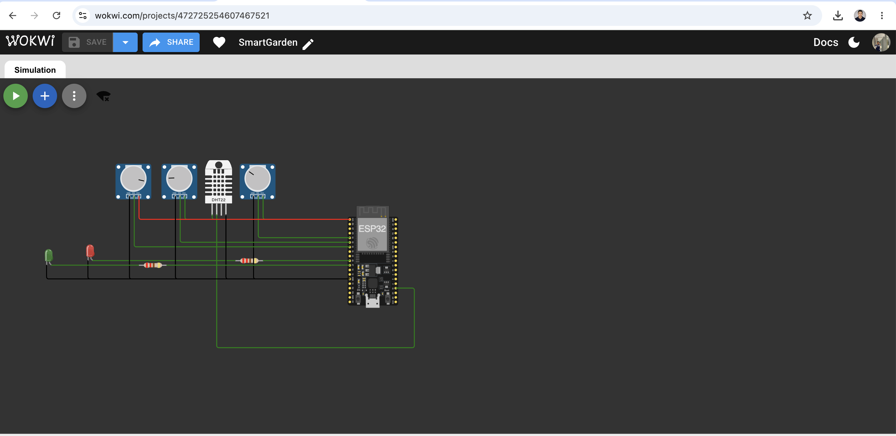
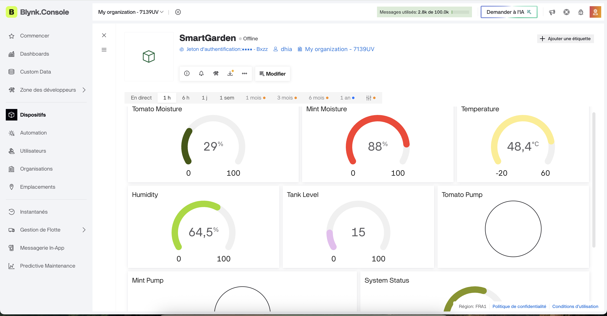

# 🌱 SmartGarden ESP32

An **IoT-based smart irrigation system** built with ESP32, C++ using the Arduino framework, Wokwi, and Blynk.

The system monitors environmental and soil conditions for two independent plant zones — **Tomatoes** and **Mint** — and automatically controls irrigation while also providing real-time monitoring and manual control through a Blynk IoT dashboard.

## 📸 Project Preview

### Wokwi Simulation



### Blynk IoT Dashboard



---

## 🚀 Features

* 🌱 Multi-zone soil moisture monitoring
* 🍅 Independent Tomato irrigation control
* 🌿 Independent Mint irrigation control
* 🤖 Automatic irrigation
* 🎮 Manual irrigation control
* 🔄 AUTO / MANUAL operating modes
* 🌡️ Temperature monitoring
* 💧 Humidity monitoring
* 🚰 Water tank level monitoring
* 📱 Real-time Blynk IoT dashboard
* 🛑 Low-water tank protection
* ⚠️ Soil sensor fault detection
* ⚠️ DHT22 fault detection
* ⏱️ Automatic pump timeout
* 🔁 Irrigation cooldown protection
* 🖥️ Full Wokwi simulation

---

## 🧠 System Architecture

```text
                        BLYNK CLOUD
                             │
                           Wi-Fi
                             │
                             ▼
                           ESP32
                             │
          ┌──────────────────┼──────────────────┐
          │                  │                  │
        DHT22           Water Tank        Soil Sensors
          │                  │              │      │
    Temperature          Tank Level      Tomato   Mint
     Humidity                              │        │
                                           ▼        ▼
                                        Pump 1   Pump 2
```

The **ESP32** acts as the main controller.

It continuously reads the sensors, evaluates the condition of each plant zone, controls the irrigation pumps, applies safety rules, and communicates with the Blynk cloud through Wi-Fi.

---

## 🌱 Plant Zones

### 🍅 Tomatoes

* Soil moisture sensor: **GPIO 34**
* Pump: **GPIO 26**
* Watering threshold: **45%**
* Healthy moisture level: **50%**

### 🌿 Mint

* Soil moisture sensor: **GPIO 32**
* Pump: **GPIO 27**
* Watering threshold: **30%**
* Healthy moisture level: **35%**

Each zone is controlled independently, allowing different plants to have different watering requirements.

---

## 🔌 ESP32 Pin Mapping

| Component          | ESP32 Pin |
| ------------------ | --------- |
| Tomato Soil Sensor | GPIO 34   |
| Mint Soil Sensor   | GPIO 32   |
| DHT22              | GPIO 15   |
| Water Tank Sensor  | GPIO 35   |
| Tomato Pump        | GPIO 26   |
| Mint Pump          | GPIO 27   |

---

## 📱 Blynk IoT Integration

Blynk provides remote monitoring and control of the SmartGarden system.

### Datastreams

| Virtual Pin | Function                   |
| ----------- | -------------------------- |
| V0          | Tomato soil moisture       |
| V1          | Mint soil moisture         |
| V2          | Temperature                |
| V3          | Humidity                   |
| V4          | Water tank level           |
| V5          | Tomato pump status         |
| V6          | Mint pump status           |
| V7          | System status              |
| V8          | AUTO / MANUAL mode         |
| V9          | Manual Tomato pump control |
| V10         | Manual Mint pump control   |

The dashboard displays sensor telemetry and allows the irrigation system to be controlled remotely.

---

## 🤖 Automatic Irrigation Mode

When **AUTO mode** is enabled, the ESP32 decides when each plant requires irrigation.

A pump can start when:

* Soil moisture falls below the plant's threshold
* The soil sensor is functioning correctly
* The water tank contains enough water
* The pump is currently OFF
* The irrigation cooldown has finished

Once irrigation begins, the pump automatically stops after the configured watering duration.

This prevents unnecessary continuous watering.

---

## 🎮 Manual Control Mode

When **AUTO mode is disabled**, the pumps can be controlled remotely from the Blynk dashboard.

* **V9** → Tomato pump
* **V10** → Mint pump

After a manual watering cycle finishes, the ESP32 updates the corresponding Blynk control back to OFF so that the dashboard always reflects the real pump state.

Safety conditions remain active even during manual operation.

---

## 🛡️ Safety & Fault Handling

The system includes several protection mechanisms to make the irrigation logic more robust.

### 🚰 Low Tank Protection

If the water tank level becomes too low:

* New irrigation cycles are blocked
* Running pumps are stopped
* The system reports the low-tank condition

### ⚠️ Soil Sensor Fault Detection

Repeated extreme ADC readings are interpreted as a possible disconnected or failed soil sensor.

When a sensor fault is detected, irrigation for that plant zone is blocked.

### 🌡️ DHT22 Fault Detection

Repeated invalid temperature or humidity readings trigger a DHT sensor fault.

This prevents invalid environmental measurements from being treated as valid data.

### ⏱️ Pump Timeout

A pump cannot remain ON indefinitely.

Each watering cycle automatically stops after the configured watering duration.

### 🔁 Irrigation Cooldown

After watering, the system waits before allowing another automatic irrigation cycle.

This helps prevent rapid repeated pump activation.

---

## 📊 System States

The controller evaluates the overall condition of the SmartGarden and reports states such as:

```text
NORMAL
WATERING
LOW_TANK
HIGH_TEMPERATURE
CRITICAL
SENSOR_FAULT
```

These states are also transmitted to Blynk for remote monitoring.

---

## 💻 Technologies Used

* **ESP32**
* **C++**
* **Arduino framework**
* **Blynk IoT**
* **Wokwi**
* **DHT22**
* **Analog soil moisture sensing**
* **Water level sensing**
* **Git**
* **GitHub**

---

## 📂 Repository Structure

```text
SmartGarden-ESP32/
│
├── sketch.ino
├── diagram.json
├── libraries.txt
├── wokwi-project.txt
├── wokwi-simulation.png
├── blynk-dashboard.png
└── README.md
```

### `sketch.ino`

Main ESP32 firmware containing sensor acquisition, irrigation control, Blynk communication, operating modes, and safety logic.

### `diagram.json`

Wokwi circuit configuration.

### `libraries.txt`

Libraries required by the Wokwi simulation.

---

## ▶️ Running the Project

1. Open the project in **Wokwi**.
2. Create a Blynk Template and Device.
3. Configure the required Blynk datastreams from **V0 to V10**.
4. Add your own Blynk Template ID and Auth Token to the firmware.
5. Start the Wokwi simulation.
6. Open the Blynk dashboard.
7. Monitor the sensor values and test AUTO/MANUAL irrigation.

---

## 🔮 Future Improvements

Possible next steps for the project include:

* 🔧 Building a physical hardware prototype
* 🧩 Designing a custom PCB
* 📲 Blynk notifications and alerts
* 📈 Historical sensor-data analysis
* 🌱 Additional plant zones
* 🌦️ Weather-aware irrigation
* 💧 Water consumption tracking
* 🔋 Battery/solar-powered operation

---

## 👨‍💻 Author

**Dhia Bekri**

Information Engineering student interested in **embedded systems, IoT, software development, and intelligent connected devices**.

